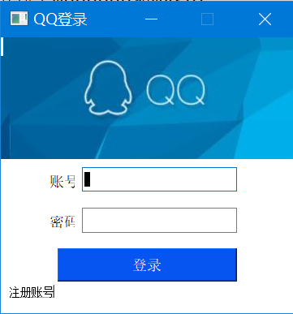
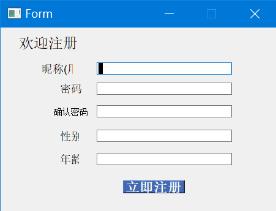
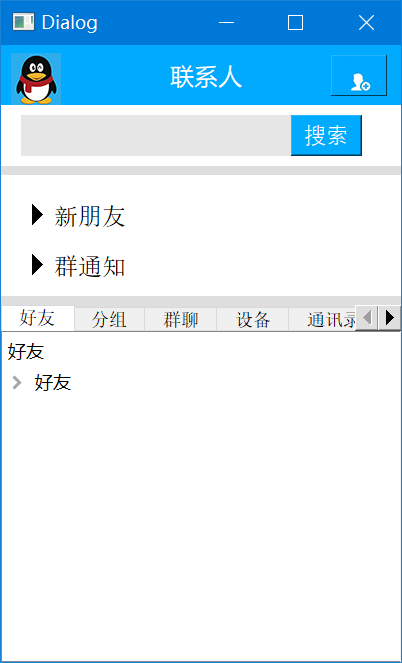
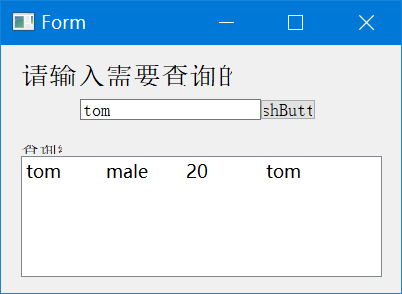
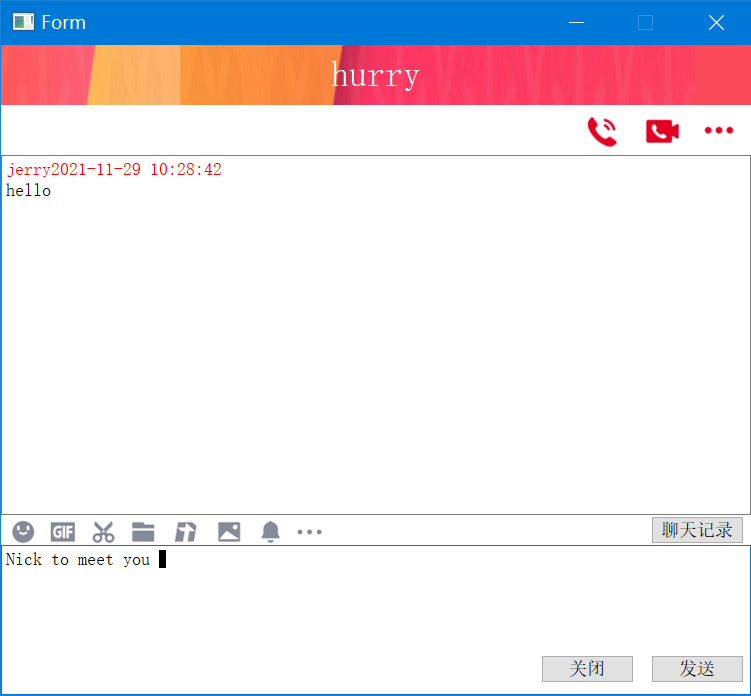
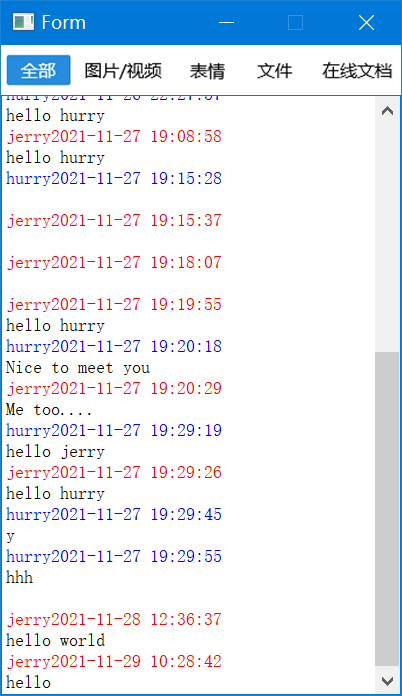

# nosql-poject 社交软件
nosql 大作业项目

---

## Table of Contents

- [Introduction](#Introduction)
  
  本软件是基于tcp协议，利用python pyqt5 图形库开发的一个社交软件，主要功能是注册，登录，添加好友与聊天。
  
  主要使用到了mongodb和mysql:
    - mongodb 存储聊天记录(文档日志类信息)
    - mysql 存储用户信息(结构化用户信息)
  
  功能展示:
  - 登录
  
    
    
  - 注册
  
    
    
  - 好友列表
  
    
    
  - 查询好友（添加好友）
  
    
    
  - 聊天
  
    
    
  - 历史消息查询
  
    
    
- [Install](#install)

  ```shell
  # install the packages required
  pip install -r requirements.txt;
  ```
  
- [Usage](#usage)
  
  ```shell
  # optional (1 / 2) server
  python TcpServer.py;
  # optinoal (1 / 2) client
  python ./ui/login.py;
  ```

- [Contributing](#contributing)
  - 前端
    - 卜蓉娟
    - 陈亦凡
    - 龙茜
    - 陈紫欣
    - 张薇
    - 朱立舸
    - 于志
    - 朱新宇
    - 韩童彤
    
  - 数据库
    - 罗欣妍
    - 陈薇	
    - 刘佳欣
    - 胡至成
    - 冯小倩
    - 韩玲玉

  - 后端
    - 花磊
    - 姚秋垒
    - 张晨希
